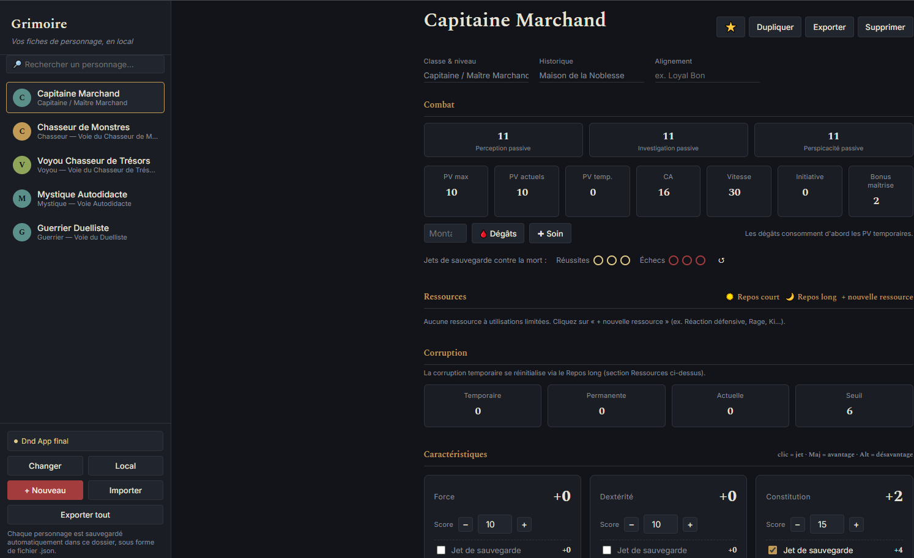

# Grimoire

A simple, local character sheet manager for **Ruins of Symbaroum**.



Grimoire lets you create and manage your characters directly in your browser.

## Features

* Character sheets
* Ability scores, skills and saving throws
* HP, AC, initiative and death saves
* Weapons and dice rolls
* Spells and spellcasting
* Resources and rests
* Corruption system
* JSON import/export
* Automatic local saving
* Optional folder synchronization

## How to use

1. Open **Grimoire.html** in a supported browser.
2. Create a character with **+ Nouveau**.
3. Edit the character directly in the sheet.
4. Changes are saved automatically.

### Save your characters

By default, characters are stored locally in your browser using `localStorage`.

You can also use **📁 Lier un dossier** in Chrome or Edge.

Choose a folder on your computer and Grimoire will automatically read and save character `.json` files in that folder.

### Import / Export

You can export:

* One character as a `.json` file
* All characters as a single `.json` file

You can also import existing Grimoire JSON files.

## GitHub Pages

Grimoire is a client-side application.

No server or database is required. GitHub Pages only hosts the application; character data stays on the user's computer.

For folder synchronization, use Chrome or Edge.

## Files

```text
Grimoire/
└── Grimoire.html
```

That's it. No backend, database, or build process is required.

## Credits

Created as a character sheet tool for **Ruins of Symbaroum**.
